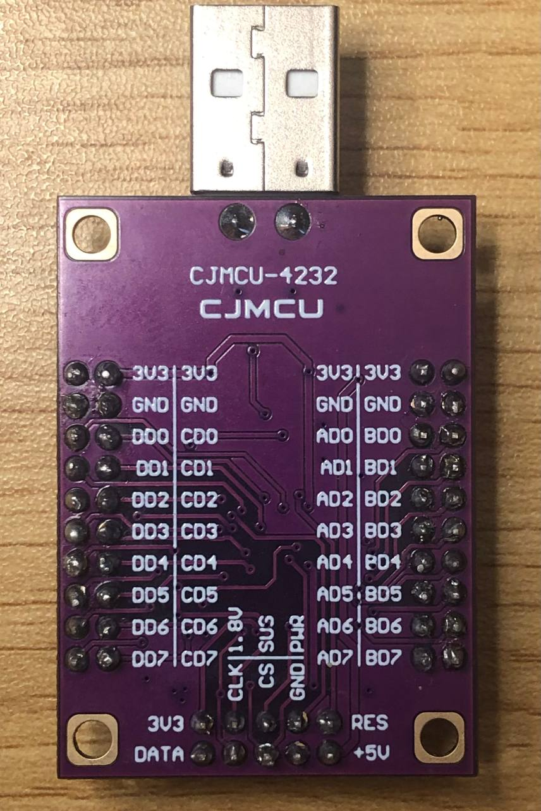

## Functional Test

## UART Adapter Test Menu
<a id="top"></a>
- [CJMCU-4232](#cjmcu-4232)
- [CP2102](#cp2102)

Disconnect other USB-to-UART adapters before testing so that `/dev/ttyUSB*` numbering remains predictable.

### CJMCU-4232

<p >
  
  
</p>

The CJMCU-4232 provides four independent UART channels.

| Channel | TX–RX loopback | USB interface | Typical port   |
| ------- | -------------- | ------------: | -------------- |
| A       | `AD0 ↔ AD1`    |          `00` | `/dev/ttyUSB0` |
| B       | `BD0 ↔ BD1`    |          `01` | `/dev/ttyUSB1` |
| C       | `CD0 ↔ CD1`    |          `02` | `/dev/ttyUSB2` |
| D       | `DD0 ↔ DD1`    |          `03` | `/dev/ttyUSB3` |

Check whether the adapter is detected:

```bash
lsusb | grep 0403:6011
```

Expected output:

```text
Bus 001 Device 004: ID 0403:6011 Future Technology Devices International, Ltd FT4232H
```

Check the serial ports:

```bash
ls -l /dev/ttyUSB*
```

Expected ports:

```text
/dev/ttyUSB0
/dev/ttyUSB1
/dev/ttyUSB2
/dev/ttyUSB3
```

To test channel C, disconnect the board from USB and connect `CD0` to `CD1`. Reconnect the board and verify the USB interface:

```bash
udevadm info -q property -n /dev/ttyUSB2 | grep ID_USB_INTERFACE_NUM
```

Expected output:

```text
ID_USB_INTERFACE_NUM=02
```

Run the loopback test at 921600 baud:

```bash
PORT=/dev/ttyUSB2
stty -F "$PORT" 921600 cs8 -cstopb -parenb raw -echo -ixon -ixoff -crtscts
( sleep 0.2; printf 'UART_TEST_921600\n' > "$PORT" ) &
timeout 2 dd if="$PORT" bs=1 count=17 status=none
```

Expected output:

```text
UART_TEST_921600
```


This confirms that the TX and RX lines of channel C are operating correctly at 921600 baud.

Messages such as `[1] 2011` and `[1]+ Done` are normal Bash job-control messages and do not indicate an error.


```text
```

### CP2102
[⬆️ Back to top](#top)

Disconnect the CJMCU-4232 and connect the CP2102 adapter.

Check whether the adapter is detected:

```bash
lsusb | grep 10c4:ea60
```

Expected output:

```text
Bus 001 Device 005: ID 10c4:ea60 Silicon Labs CP210x UART Bridge
```

Check the serial port:

```bash
ls -l /dev/ttyUSB*
```

If no other USB-to-UART adapters are connected, the expected port is:

```text
/dev/ttyUSB0
```

Disconnect the CP2102 from USB and connect `TXD` to `RXD`. Reconnect the adapter and run the loopback test:

```bash
PORT=/dev/ttyUSB0
stty -F "$PORT" 115200 cs8 -cstopb -parenb raw -echo -ixon -ixoff -crtscts
( sleep 0.2; printf 'CP2102_TEST_115200\n' > "$PORT" ) &
timeout 2 dd if="$PORT" bs=1 count=19 status=none
```

Expected output:

```text
CP2102_TEST_115200
```

If the same text is returned without changes, the CP2102 TX and RX lines are operating correctly.

### Permission errors

If the terminal reports `Permission denied`, add the current user to the serial-port access group:

```bash
sudo usermod -aG dialout "$USER"
```

Log out and log back in, or reboot the system for the change to take effect.

### Connecting a UART device

Remove the loopback jumper before connecting an external device:

```text
Adapter TX  → Device RX
Adapter RX  ← Device TX
Adapter GND ↔ Device GND
```

Do not connect TTL UART pins directly to RS-232 or RS-485 equipment without the appropriate level converter or transceiver.


[⬆️ Back to top](#top)